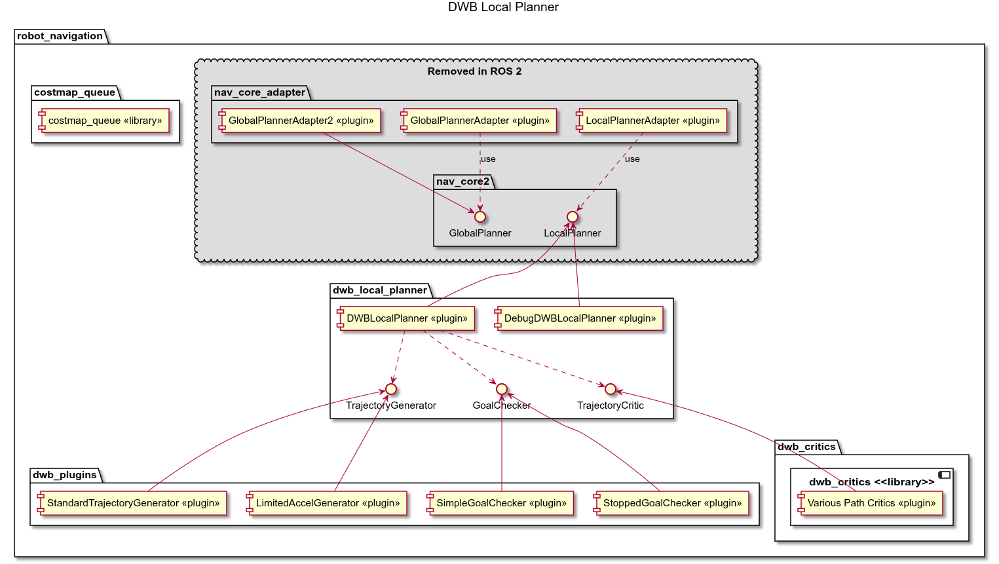

# nav2的DWA算法

如图所示，DWA算法包含了多个模块，包括：
1. costmap模块
2. 标准的轨迹生成模块(运动学约束)
3. 带加速度限制的轨迹生成模块(动力学约束)
4. 两个到达目标的检测模块
5. 路径评分模块
这些模块都以plugin的方式注册在dwa planner中

## 标准轨迹生成模块 standard_traj_generator.hpp
我们通过sim_time来模块轨迹的生成总时间，根据不同的时间离散方式，生成不同的轨迹。
1. 按固定时间离散生成轨迹
这个就很简单了，steps.resize(ceil(sim_time_ / time_granularity_))，按固定时间步长生成轨迹。
2. 按固定空间离散生成轨迹——默认方式
```
double vmag = hypot(cmd_vel.x, cmd_vel.y);
// 预测总行进直线距离
double projected_linear_distance = vmag * sim_time_;
// 预测总旋转角度
double projected_angular_distance = fabs(cmd_vel.theta) * sim_time_;

// 分别计算满足线速度、角速度所需步数，取更大值
int num_steps = ceil(
  std::max(
    projected_linear_distance / linear_granularity_,
    projected_angular_distance / angular_granularity_
));
steps.resize(num_steps);
```
### 生成速度
```
nav_2d_msgs::msg::Twist2D StandardTrajectoryGenerator::computeNewVelocity(
  const nav_2d_msgs::msg::Twist2D & cmd_vel,
  const nav_2d_msgs::msg::Twist2D & start_vel, const double dt)
{
  KinematicParameters kinematics = kinematics_handler_->getKinematics();
  nav_2d_msgs::msg::Twist2D new_vel;
  new_vel.x = projectVelocity(
    start_vel.x, kinematics.getAccX(),
    kinematics.getDecelX(), dt, cmd_vel.x);
  new_vel.y = projectVelocity(
    start_vel.y, kinematics.getAccY(),
    kinematics.getDecelY(), dt, cmd_vel.y);
  new_vel.theta = projectVelocity(
    start_vel.theta,
    kinematics.getAccTheta(), kinematics.getDecelTheta(),
    dt, cmd_vel.theta);
  return new_vel;
}
```
### 生成pose
```
geometry_msgs::msg::Pose StandardTrajectoryGenerator::computeNewPosition(
  const geometry_msgs::msg::Pose start_pose,
  const nav_2d_msgs::msg::Twist2D & vel, const double dt)
{
  geometry_msgs::msg::Pose new_pose;

  double theta = tf2::getYaw(start_pose.orientation);
  new_pose.position.x = start_pose.position.x +
    (vel.x * cos(theta) + vel.y * cos(M_PI_2 + theta)) * dt;
  new_pose.position.y = start_pose.position.y +
    (vel.x * sin(theta) + vel.y * sin(M_PI_2 + theta)) * dt;

  double new_theta = theta + vel.theta * dt;
  tf2::Quaternion q;
  q.setRPY(0.0, 0.0, new_theta);
  new_pose.orientation = tf2::toMsg(q);

  return new_pose;
}
```
### 组装轨迹
```
dwb_msgs::msg::Trajectory2D StandardTrajectoryGenerator::generateTrajectory(
  const geometry_msgs::msg::Pose & start_pose,
  const nav_2d_msgs::msg::Twist2D & start_vel,
  const nav_2d_msgs::msg::Twist2D & cmd_vel)
{
  dwb_msgs::msg::Trajectory2D traj;
  traj.velocity = cmd_vel;
  //  simulate the trajectory
  geometry_msgs::msg::Pose pose = start_pose;
  nav_2d_msgs::msg::Twist2D vel = start_vel;
  double running_time = 0.0;
  std::vector<double> steps = getTimeSteps(cmd_vel);
  traj.poses.push_back(start_pose);
  bool first_vel = false;
  for (double dt : steps) {
    //  calculate velocities
    vel = computeNewVelocity(cmd_vel, vel, dt);
    if (!first_vel && limit_vel_cmd_in_traj_) {
      traj.velocity = vel;
      first_vel = true;
    }

    //  update the position of the robot using the velocities passed in
    pose = computeNewPosition(pose, vel, dt);

    traj.poses.push_back(pose);
    traj.time_offsets.push_back(rclcpp::Duration::from_seconds(running_time));
    running_time += dt;
  }  //  end for simulation steps

  if (include_last_point_) {
    traj.poses.push_back(pose);
    traj.time_offsets.push_back(rclcpp::Duration::from_seconds(running_time));
  }

  return traj;
}
```

# 来看看dwa的算法是如何调用的
## dwa_local_planner.cpp文件中
nav2通过调用局部规划器的通用接口computeVelocityCommands方法，来获取速度命令，然后下发速度指令
在computeVelocityCommands生成轨迹，对轨迹进行评分，选择评分最高的轨迹，作为速度命令。
```c++
geometry_msgs::msg::TwistStamped DWBLocalPlanner::computeVelocityCommands(
    const geometry_msgs::msg::PoseStamped &pose,
    const geometry_msgs::msg::Twist &velocity,
    nav2_core::GoalChecker * /*goal_checker*/,
    const nav_msgs::msg::Path &transformed_global_plan,
    const geometry_msgs::msg::PoseStamped &global_goal) {
  std::shared_ptr<dwb_msgs::msg::LocalPlanEvaluation> results = nullptr;
  if (pub_->shouldRecordEvaluation()) {
    results = std::make_shared<dwb_msgs::msg::LocalPlanEvaluation>();
  }

  try {
    nav_2d_msgs::msg::Twist2DStamped cmd_vel2d =
        computeVelocityCommands(pose, nav_2d_utils::twist3Dto2D(velocity),
                                results, transformed_global_plan, global_goal);
    pub_->publishEvaluation(results);
    geometry_msgs::msg::TwistStamped cmd_vel;
    cmd_vel.twist = nav_2d_utils::twist2Dto3D(cmd_vel2d.velocity);
    return cmd_vel;
  } catch (const nav2_core::ControllerTFError &e) {
    pub_->publishEvaluation(results);
    throw e;
  } catch (const nav2_core::InvalidPath &e) {
    pub_->publishEvaluation(results);
    throw e;
  } catch (const nav2_core::NoValidControl &e) {
    pub_->publishEvaluation(results);
    throw e;
  } catch (const nav2_core::ControllerException &e) {
    pub_->publishEvaluation(results);
    throw e;
  }
}

/**
   * @brief nav2_core computeVelocityCommands - calculates the best command given the current pose and velocity
   *
   * It is presumed that the global plan is already set.
   *
   * This is mostly a wrapper for the protected computeVelocityCommands
   * function which has additional debugging info.
   *
   * @param pose Current robot pose
   * @param velocity Current robot velocity
   * @param goal_checker   Ptr to the goal checker for this task in case useful in computing commands
   * @param transformed_global_plan The global plan after being processed by the path handler
   * @param global_goal The last pose of the global plan
   * @return The best command for the robot to drive
   */
  geometry_msgs::msg::TwistStamped computeVelocityCommands(
    const geometry_msgs::msg::PoseStamped & pose,
    const geometry_msgs::msg::Twist & velocity,
    nav2_core::GoalChecker * /*goal_checker*/,
    const nav_msgs::msg::Path & transformed_global_plan,
    const geometry_msgs::msg::PoseStamped & global_goal) override;

nav_2d_msgs::msg::Twist2DStamped DWBLocalPlanner::computeVelocityCommands(
        const geometry_msgs::msg::PoseStamped &pose,
        const nav_2d_msgs::msg::Twist2D &velocity,
        std::shared_ptr<dwb_msgs::msg::LocalPlanEvaluation> &results,
        const nav_msgs::msg::Path &transformed_global_plan,
        const geometry_msgs::msg::PoseStamped &global_goal) {
    if (results) {
        results->header.frame_id = pose.header.frame_id;
        results->header.stamp = clock_->now();
    }
    // 规划时，对costmap加锁
    nav2_costmap_2d::Costmap2D *costmap = costmap_ros_->getCostmap();
    std::unique_lock<nav2_costmap_2d::Costmap2D::mutex_t> lock(
        *(costmap->getMutex()));
    // 准备好所有评分函数
    for (TrajectoryCritic::Ptr &critic : critics_) {
        if (!critic->prepare(pose.pose, velocity, global_goal.pose,
                            transformed_global_plan)) {
        RCLCPP_WARN(rclcpp::get_logger("DWBLocalPlanner"),
                    "A scoring function failed to prepare");
        }
    }

    try {
        // 生成轨迹，并获取评分最高的轨迹
        dwb_msgs::msg::TrajectoryScore best =
            coreScoringAlgorithm(pose.pose, velocity, results);

        // Return Value
        nav_2d_msgs::msg::Twist2DStamped cmd_vel;
        cmd_vel.header.stamp = clock_->now();
        cmd_vel.velocity = best.traj.velocity;

        // debrief stateful scoring functions
        for (TrajectoryCritic::Ptr &critic : critics_) {
        critic->debrief(cmd_vel.velocity);
        }

        lock.unlock();

        pub_->publishLocalPlan(pose.header, best.traj);
        pub_->publishCostGrid(costmap_ros_, critics_);

        return cmd_vel;
    } catch (const dwb_core::NoLegalTrajectoriesException &e) {
        nav_2d_msgs::msg::Twist2D empty_cmd;
        dwb_msgs::msg::Trajectory2D empty_traj;
        // debrief stateful scoring functions
        for (TrajectoryCritic::Ptr &critic : critics_) {
        critic->debrief(empty_cmd);
        }

        lock.unlock();

        pub_->publishLocalPlan(pose.header, empty_traj);
        pub_->publishCostGrid(costmap_ros_, critics_);

        throw nav2_core::NoValidControl("Could not find a legal trajectory: " +
                                        std::string(e.what()));
    }
}
```
## coreScoringAlgorithm
```c++
dwb_msgs::msg::TrajectoryScore DWBLocalPlanner::coreScoringAlgorithm(
    const geometry_msgs::msg::Pose &pose,
    const nav_2d_msgs::msg::Twist2D velocity,
    std::shared_ptr<dwb_msgs::msg::LocalPlanEvaluation> &results) {
  nav_2d_msgs::msg::Twist2D twist;
  dwb_msgs::msg::Trajectory2D traj;
  dwb_msgs::msg::TrajectoryScore best, worst;
  best.total = -1;
  worst.total = -1;
  IllegalTrajectoryTracker tracker;
  // 传入当前速度，生成一个速度序列,这个速度约束是sim_time_时间内的速度变化，并且带动力学约束的
  traj_generator_->startNewIteration(velocity);
  while (traj_generator_->hasMoreTwists()) {
    // 依次取出窗口内的速度，利用这些速度生成轨迹
    twist = traj_generator_->nextTwist();
    // 利用当前速度和窗口内的速度，生成轨迹
    traj = traj_generator_->generateTrajectory(pose, velocity, twist);

    try {
      // 对估计的轨迹进行评分
      dwb_msgs::msg::TrajectoryScore score = scoreTrajectory(traj, best.total);
      tracker.addLegalTrajectory();
      if (results) {
        results->twists.push_back(score);
      }
      if (best.total < 0 || score.total < best.total) {
        best = score;
        if (results) {
          results->best_index = results->twists.size() - 1;
        }
      }
      if (worst.total < 0 || score.total > worst.total) {
        worst = score;
        if (results) {
          results->worst_index = results->twists.size() - 1;
        }
      }
    } catch (const dwb_core::IllegalTrajectoryException &e) {
      if (results) {
        dwb_msgs::msg::TrajectoryScore failed_score;
        failed_score.traj = traj;

        dwb_msgs::msg::CriticScore cs;
        cs.name = e.getCriticName();
        cs.raw_score = -1.0;
        failed_score.scores.push_back(cs);
        failed_score.total = -1.0;
        results->twists.push_back(failed_score);
      }
      tracker.addIllegalTrajectory(e);
    }
  }

  if (best.total < 0) {
    if (debug_trajectory_details_) {
      RCLCPP_ERROR(rclcpp::get_logger("DWBLocalPlanner"), "%s",
                   tracker.getMessage().c_str());
      for (auto const &x : tracker.getPercentages()) {
        RCLCPP_ERROR(rclcpp::get_logger("DWBLocalPlanner"), "%.2f: %10s/%s",
                     x.second, x.first.first.c_str(), x.first.second.c_str());
      }
    }
    throw NoLegalTrajectoriesException(tracker);
  }

  return best;
}
```

## 对轨迹的评价
每条轨迹的评价，会根据所有评分函数的评价，进行综合评价——加权。
```c++
dwb_msgs::msg::TrajectoryScore
DWBLocalPlanner::scoreTrajectory(const dwb_msgs::msg::Trajectory2D &traj,
                                 double best_score) {
  dwb_msgs::msg::TrajectoryScore score;
  score.traj = traj;

  for (TrajectoryCritic::Ptr &critic : critics_) {
    dwb_msgs::msg::CriticScore cs;
    cs.name = critic->getName();
    cs.scale = critic->getScale();

    if (cs.scale == 0.0) {
      score.scores.push_back(cs);
      continue;
    }

    double critic_score = critic->scoreTrajectory(traj);
    cs.raw_score = critic_score;
    score.scores.push_back(cs);
    score.total += critic_score * cs.scale;
    if (short_circuit_trajectory_evaluation_ && best_score > 0 &&
        score.total > best_score) {
      // since we keep adding positives, once we are worse than the best, we
      // will stay worse
      break;
    }
  }

  return score;
}
```
# 评分函数类_抽象类
## 分类
1. 避障安全类
  - BaseObstacleCritic
  - ObstacleFootprintCritic
2. 全局路径贴合类
  - MapGridCritic
    - PathDistCritic
    - PathAlignCritic
3. 目标前进引导类
  - MapGridCritic
    - GoalAlignCritic
    - GoalDistCritic
4. 运动行为约束类
  - PreferForwardCritic
  - TwirlingCritic
5. 终点姿态校正类
  - RotateToGoalCritic
6. 振荡抖动抑制类
  - OscillationCritic
```c++
class TrajectoryCritic
{
  public:
    virtual bool prepare(
    const geometry_msgs::msg::Pose &, const nav_2d_msgs::msg::Twist2D &,
    const geometry_msgs::msg::Pose &,
    const nav_msgs::msg::Path &)
  {
    return true;
  }
  virtual double scoreTrajectory(const dwb_msgs::msg::Trajectory2D & traj) = 0;

}
```
既然已经生成了轨迹序列，那么就可以对每个轨迹进行评分了。
我们可以对一些评分函数进行预计算，减少对轨迹的重复计算。
核心特性
  一次规划周期仅执行一次prepare
  无论动态窗口内采样几十上百条轨迹，所有 Critic 只做 1 次全局预处理；
  预计算全局路径、障碍物、目标点等固定上下文，避免每条轨迹重复计算，大幅降低 CPU 开销。
  prepare 入参是本周期全局固定信息
  当前机器人位姿、当前速度、全局目标、裁剪后的局部全局路径，在整个coreScoringAlgorithm循环中不会变化。
  若任意 Critic 的prepare返回false仅打印警告，不会直接中断规划；
  但该 Critic 后续对所有轨迹打分时会判定轨迹非法，拉高总代价甚至直接抛出碰撞异常。
  那么这些评价函数在prepare中，计算了什么呢？


## 旋转惩罚评分类 TwirlingCritic
这是 Navigation2（ROS2）中 dwb_critics 代价插件，TwirlingCritic 专门给轨迹增加旋转速度惩罚：
针对全向 / 类全向机器人（麦克纳姆轮等），抑制机器人在前往目标途中无意义原地打转、频繁转向；差分轮机器人本身必须靠旋转调整航向，该代价对其影响很小
```c++
/**
 *  轨迹的分数越低是越好的，这里我们使用了角度的绝对值作为评分函数
 *  如果角速度过大，这条轨迹的分数就会越高，这个估计就没有那么优秀，当然外面用了scale_来调整
 *
 */
double
TwirlingCritic::scoreTrajectory(const dwb_msgs::msg::Trajectory2D &traj) {
  return fabs(traj.velocity.theta); // add cost for making the robot spin
}
```
## 对准目标航向代价器 RotateToGoalCritic
当机器人抵达目标 XY 平面容差范围内时，强制机器人先停掉平移，只允许原地旋转对准目标航向 yaw，解决到达点位但朝向不对、直接冲过目标不调航向的问题
远处（!in_window_）
  返回 0，不干预轨迹，无任何惩罚；
靠近目标、仍在减速阶段（in_window=true, rotating=false）
  禁止加速：候选轨迹平移速度 ≥ 当前真实速度 → 抛异常，直接丢弃；
  允许减速轨迹，代价由两部分组成：减速惩罚 + 航向对齐代价；
  速度越大代价越高，强制减速同时引导对准目标朝向；
到位几乎静止（rotating=true）
  任何带 x/y 平移的轨迹直接非法丢弃；
  只允许纯旋转轨迹，仅评估航向偏差。
```c++
RotateToGoalCritic::scoreTrajectory(const dwb_msgs::msg::Trajectory2D &traj) {
  // If we're not sufficiently close to the goal, we don't care what the twist
  // is
  // 如果还没在目标点附近，直接返回0.0，该评价轨迹无效，不被考虑
  if (!in_window_) {
    return 0.0;
  } else if (!rotating_) {
    // 阶段2：在窗口内，但还没进入静止旋转状态（仍有明显线速度）
    double speed_sq = hypot_sq(traj.velocity.x, traj.velocity.y);
    if (speed_sq >= current_xy_speed_sq_) {
      // 规则：不允许比当前机器人速度更快的轨迹，加速轨迹直接判定非法抛异常
      throw dwb_core::IllegalTrajectoryException(name_,
                                                 "Not slowing down near goal.");
    }
    // 代价 = 轨迹平移速度平方 × 减速惩罚系数 + 航向偏差代价
    // 速度越高，代价越高，然后就会选择代价最低的轨迹，也就是速度更低的轨迹
    return speed_sq * slowing_factor_ + scoreRotation(traj);
  }

  // If we're sufficiently close to the goal, any transforming velocity is
  // invalid
  // 只要轨迹存在x/y平移，直接抛出异常，轨迹作废
  if (fabs(traj.velocity.x) > 0 || fabs(traj.velocity.y) > 0) {
    throw dwb_core::IllegalTrajectoryException(
        name_, "Nonrotation command near goal.");
  }
  // 阶段3：在窗口内，且进入纯旋转状态（没有明显线速度）
  return scoreRotation(traj);
}
```

## 优先向前行驶代价器 PreferForwardCritic
该代价器强制机器人优先向前直行，三大约束目标：
  严厉惩罚倒车（x 负向速度）；
  惩罚低速平移 + 小幅原地打转的低效轨迹；
  对正常前进轨迹，仅轻微惩罚转向角速度，鼓励走直线。
适用于差分轮、阿克曼车等非全向机器人；全向麦轮机器人一般可关闭，避免限制横移能力
```c++
double
PreferForwardCritic::scoreTrajectory(const dwb_msgs::msg::Trajectory2D &traj) {
  // backward motions bad on a robot without backward sensors
  // 轨迹 x 方向速度为负 → 倒车，高额固定惩罚， 直接返回负数
  if (traj.velocity.x < 0.0) {
    return penalty_;
  }
  // strafing motions also bad on such a robot
  // 低速前进 + 微弱旋转 → 小幅蠕行打转，同样重罚
  if (traj.velocity.x < strafe_x_ &&
      fabs(traj.velocity.theta) < strafe_theta_) {
    return penalty_;
  }

  // the more we rotate, the less we progress forward
  // 正常高速前进，仅对转向大小线性扣分
  // 代价只和旋转角速度成正比：转向越大，分数越高,
  // 鼓励尽量走直线，减少大角度转弯
  return fabs(traj.velocity.theta) * theta_scale_;
}
```

## 路径前向对齐代价器 PathAlignCritic
父类 PathDistCritic：基础路径距离代价器，核心逻辑是给一个点位姿，计算该点距离全局参考路径的横向偏差，返回偏差距离作为代价；
PathAlignCritic 在其基础上做改造：不使用机器人中心，改用机器人前方一个偏移点来算路径偏差，强制机器人车头贴合全局路径，行驶更贴合全局规划轨迹。
```c++
bool PathAlignCritic::prepare(const geometry_msgs::msg::Pose &pose,
                              const nav_2d_msgs::msg::Twist2D &vel,
                              const geometry_msgs::msg::Pose &goal,
                              const nav_msgs::msg::Path &global_plan) {
  double dx = pose.position.x - goal.position.x;
  double dy = pose.position.y - goal.position.y;
  double sq_dist = dx * dx + dy * dy;
  // 距离目标较远：zero_scale_ = false，代价权重正常生效，强制车头贴合全局路径
  if (sq_dist > forward_point_distance_ * forward_point_distance_) {
    zero_scale_ = false;
  } else {
    // 距离目标很近（小于车头虚拟点长度）：zero_scale_ = true，直接
    // return，不再执行父类
    zero_scale_ = true;
    return true;
  }
  // 生成距离全局路径的曼哈顿距离场
  return PathDistCritic::prepare(pose, vel, goal, global_plan);
}

double PathAlignCritic::getScale() const {
  if (zero_scale_) {
    return 0.0;
  } else {
    return costmap_->getResolution() * 0.5 * scale_;
  }
}

double PathAlignCritic::scorePose(const geometry_msgs::msg::Pose &pose) {
  // 沿机器人航向向前偏移 forward_point_distance_ 生成车头虚拟点
  // 使用车头点计算到全局路径的横向偏差代价
  // 调用MapGrid的scorePose方法
  // 返回横向偏差代价，越靠近全局路径，代价越小
  return PathDistCritic::scorePose(
      getForwardPose(pose, forward_point_distance_));
}
```

## 振荡抑制代价器 OscillationCritic
专门抑制机器人来回抖、反复换向、小幅往复震荡问题：
连续短距离内频繁切换 x/y/theta 速度正负（前进↔后退、左转↔右转、横移左↔右），判定为振荡轨迹，直接打极高惩罚分，禁止规划器选择这类抖动指令。
典型场景：窄通道、目标附近、传感器噪声下小车前后 / 左右反复小幅窜动，造成车身抖动、磨损、控制不稳。
```
```
##  代价地图广度优先栅格代价器 MapGridCritic


```c++
double MapGridCritic::scoreTrajectory(const dwb_msgs::msg::Trajectory2D &traj) {
  double score = 0.0;
  unsigned int start_index = 0;
  if (aggregationType_ == ScoreAggregationType::Product) {
    score = 1.0; // 乘积模式初始值为1，乘法累加
  } else if (aggregationType_ == ScoreAggregationType::Last &&
             !stop_on_failure_) {
    // 仅遍历最后一个点,不开启障碍检测时，直接把起始索引跳到最后一个点，只循环一次，大幅节省计算。
    start_index = traj.poses.size() - 1;
  }
  double grid_dist;
  // 循环遍历轨迹点位姿
  for (unsigned int i = start_index; i < traj.poses.size(); ++i) {
    // 获取单个点位栅格代价
    grid_dist = scorePose(traj.poses[i]);
    if (stop_on_failure_) {
      // 如果碰到障碍物或未知区域，抛出异常，停止遍历
      if (grid_dist == obstacle_score_) {
        throw dwb_core::IllegalTrajectoryException(name_,
                                                   "Trajectory Hits Obstacle.");
      } else if (grid_dist == unreachable_score_) {
        throw dwb_core::IllegalTrajectoryException(
            name_, "Trajectory Hits Unreachable Area.");
      }
    }
    // 累计轨迹的代价
    switch (aggregationType_) {
    case ScoreAggregationType::Last:
      score = grid_dist;
      break;
    case ScoreAggregationType::Sum:
      score += grid_dist;
      break;
    case ScoreAggregationType::Product:
      if (score > 0) {
        score *= grid_dist;
      }
      break;
    }
  }

  return score;
}
```


## 目标对齐代价器 GoalAlignCritic
GoalAlignCritic 在其基础上做两点改造：
动态选取可视范围内全局路径最远点作为对齐参考点（不固定终点）；
打分时不用机器人中心，改用车头前向虚拟点计算偏差，强制车头朝向前进纵深。
与 GoalDistCritic 区别
GoalDistCritic：仅以最终目标点为源，打分基准是机器人中心；只惩罚距离目标远近，不约束车头朝向；
GoalAlignCritic：以可视范围内最远路径点为源，打分基准是车头前向点；兼顾距离 + 航向对齐，强制车头朝前进纵深。
```c++
bool GoalAlignCritic::prepare(const geometry_msgs::msg::Pose &pose,
                              const nav_2d_msgs::msg::Twist2D &vel,
                              const geometry_msgs::msg::Pose &goal,
                              const nav_msgs::msg::Path &global_plan) {
  // 计算机器人当前位置指向目标点的方位角
  double angle_to_goal = atan2(goal.position.y - pose.position.y,
                               goal.position.x - pose.position.x);
  // 路径最后一个点（原目标点）沿目标方向向前偏移 forward_point_distance_
  nav_msgs::msg::Path target_poses = global_plan;
  target_poses.poses.back().pose.position.x +=
      forward_point_distance_ * cos(angle_to_goal);
  target_poses.poses.back().pose.position.y +=
      forward_point_distance_ * sin(angle_to_goal);

  return GoalDistCritic::prepare(pose, vel, goal, target_poses);
}

double GoalAlignCritic::scorePose(const geometry_msgs::msg::Pose &pose) {
  return GoalDistCritic::scorePose(
      getForwardPose(pose, forward_point_distance_));
}

bool GoalDistCritic::prepare(const geometry_msgs::msg::Pose &,
                             const nav_2d_msgs::msg::Twist2D &,
                             const geometry_msgs::msg::Pose &,
                             const nav_msgs::msg::Path &global_plan) {
  reset();

  unsigned int local_goal_x, local_goal_y;
  // 局部地图的最后一个点（原目标点）的索引
  if (!getLastPoseOnCostmap(global_plan, local_goal_x, local_goal_y)) {
    return false;
  }

  // Enqueue just the last pose
  // 将目标点的索引添加到队列中
  int index = costmap_->getIndex(local_goal_x, local_goal_y);
  cell_values_[index] = 0.0;
  // 将目标点的索引添加到队列中
  queue_->enqueueCell(local_goal_x, local_goal_y);
  // 传播曼哈顿距离
  propagateManhattanDistances();

  return true;
}

```
## 机器人基础障碍物代价 BaseObstacleCritic
以机器人中心为源，计算轨迹点位姿与障碍物的代价，返回轨迹的总代价。
```c++
double
BaseObstacleCritic::scoreTrajectory(const dwb_msgs::msg::Trajectory2D &traj) {
  // 以机器人中心为源，计算轨迹点位姿与障碍物的代价，返回轨迹的总代价。
  double score = 0.0;
  for (unsigned int i = 0; i < traj.poses.size(); ++i) {
    double pose_score = scorePose(traj.poses[i]);
    // Optimized/branchless version of if (sum_scores_) score += pose_score,
    // else score = pose_score;
    // 累计轨迹的代价或者取最后一个点的代价
    score = static_cast<double>(sum_scores_) * score + pose_score;
  }
  return score;
}

double BaseObstacleCritic::scorePose(const geometry_msgs::msg::Pose &pose) {
  unsigned int cell_x, cell_y;
  // 1. 世界坐标转栅格坐标，判断是否超出costmap边界
  if (!costmap_->worldToMap(pose.position.x, pose.position.y, cell_x, cell_y)) {
    throw dwb_core::IllegalTrajectoryException(name_,
                                               "Trajectory Goes Off Grid.");
  }
  // 2. 获取栅格代价
  unsigned char cost = costmap_->getCost(cell_x, cell_y);
  // 3. 判断是否为障碍物，致命障碍 / 内切障碍 / 未知区域
  if (!isValidCost(cost)) {
    throw dwb_core::IllegalTrajectoryException(name_,
                                               "Trajectory Hits Obstacle.");
  }
  return cost;
}

bool BaseObstacleCritic::isValidCost(const unsigned char cost) {
  return cost != nav2_costmap_2d::LETHAL_OBSTACLE &&
         cost != nav2_costmap_2d::INSCRIBED_INFLATED_OBSTACLE &&
         cost != nav2_costmap_2d::NO_INFORMATION;
}
```

## 自定义机器人形状(正方形，矩形） ObstacleFootprintCritic
```c++
double
ObstacleFootprintCritic::scorePose(const geometry_msgs::msg::Pose &pose) {
  unsigned int cell_x, cell_y;
  if (!costmap_->worldToMap(pose.position.x, pose.position.y, cell_x, cell_y)) {
    throw dwb_core::IllegalTrajectoryException(name_,
                                               "Trajectory Goes Off Grid.");
  }
  return scorePose(pose, getOrientedFootprint(pose, footprint_spec_));
}

double ObstacleFootprintCritic::scorePose(const geometry_msgs::msg::Pose &,
                                          const Footprint &footprint) {
  // now we really have to lay down the footprint in the costmap grid
  unsigned int x0, x1, y0, y1;
  double line_cost = 0.0;
  double footprint_cost = 0.0;

  // we need to rasterize each line in the footprint
  for (unsigned int i = 0; i < footprint.size() - 1; ++i) {
    // get the cell coord of the first point
    if (!costmap_->worldToMap(footprint[i].x, footprint[i].y, x0, y0)) {
      throw dwb_core::IllegalTrajectoryException(name_,
                                                 "Footprint Goes Off Grid.");
    }

    // get the cell coord of the second point
    if (!costmap_->worldToMap(footprint[i + 1].x, footprint[i + 1].y, x1, y1)) {
      throw dwb_core::IllegalTrajectoryException(name_,
                                                 "Footprint Goes Off Grid.");
    }

    line_cost = lineCost(x0, x1, y0, y1);
    footprint_cost = std::max(line_cost, footprint_cost);
  }

  // we also need to connect the first point in the footprint to the last point
  // get the cell coord of the last point
  if (!costmap_->worldToMap(footprint.back().x, footprint.back().y, x0, y0)) {
    throw dwb_core::IllegalTrajectoryException(name_,
                                               "Footprint Goes Off Grid.");
  }

  // get the cell coord of the first point
  if (!costmap_->worldToMap(footprint.front().x, footprint.front().y, x1, y1)) {
    throw dwb_core::IllegalTrajectoryException(name_,
                                               "Footprint Goes Off Grid.");
  }

  line_cost = lineCost(x0, x1, y0, y1);
  footprint_cost = std::max(line_cost, footprint_cost);

  // if all line costs are legal... then we can return that the footprint is
  // legal
  return footprint_cost;
}

double ObstacleFootprintCritic::lineCost(int x0, int x1, int y0, int y1) {
  double line_cost = 0.0;
  double point_cost = -1.0;
  // Bresenham line algorithm
  for (LineIterator line(x0, y0, x1, y1); line.isValid(); line.advance()) {
    point_cost = pointCost(line.getX(), line.getY()); // Score the current point

    if (line_cost < point_cost) {
      line_cost = point_cost;
    }
  }

  return line_cost;
}

double ObstacleFootprintCritic::pointCost(int x, int y) {
  unsigned char cost = costmap_->getCost(x, y);
  // if the cell is in an obstacle the path is invalid or unknown
  if (cost == nav2_costmap_2d::LETHAL_OBSTACLE) {
    throw dwb_core::IllegalTrajectoryException(name_,
                                               "Trajectory Hits Obstacle.");
  } else if (cost == nav2_costmap_2d::NO_INFORMATION) {
    throw dwb_core::IllegalTrajectoryException(
        name_, "Trajectory Hits Unknown Region.");
  }

  return cost;
}
```

### Bresenham 算法

```c++
int dx = x1 - x0;
int dy = y1 - y0;
float k = (float)dy / dx;
for (int x = x0; x <= x1; x++)
{
    float yf = y0 + k * (x - x0);
    int y = round(yf);
    // 查询栅格(x,y)代价
}
```


# 轨迹的判断
```c++
dwb_msgs::msg::TrajectoryScore DWBLocalPlanner::coreScoringAlgorithm(
    const geometry_msgs::msg::Pose &pose,
    const nav_2d_msgs::msg::Twist2D velocity,
    std::shared_ptr<dwb_msgs::msg::LocalPlanEvaluation> &results) {
  nav_2d_msgs::msg::Twist2D twist;
  dwb_msgs::msg::Trajectory2D traj;
  dwb_msgs::msg::TrajectoryScore best, worst;
  best.total = -1;
  worst.total = -1;
  IllegalTrajectoryTracker tracker;
  // 传入当前速度，生成一个速度序列,这个速度约束是sim_time_时间内的速度变化，并且带动力学约束的
  traj_generator_->startNewIteration(velocity);
  while (traj_generator_->hasMoreTwists()) {
    // 依次取出窗口内的速度，利用这些速度生成轨迹
    twist = traj_generator_->nextTwist();
    // 利用当前速度和窗口内的速度，生成轨迹
    traj = traj_generator_->generateTrajectory(pose, velocity, twist);

    try {
      // 对估计的轨迹进行评分,第一次的轨迹如果合法，就标记为最优轨迹，后续的轨迹如果合法，就和最优轨迹进行比较，更新最优轨迹
      // 如果分数大于最优轨迹，说明更差，否则更新最优轨迹
      dwb_msgs::msg::TrajectoryScore score = scoreTrajectory(traj, best.total);
      tracker.addLegalTrajectory();
      if (results) {
        results->twists.push_back(score);
      }
      // 如果第一条轨迹也非法，第一条轨迹碰撞，score.total=-5 → best.total<0
      // 成立，更新 best=-5，等后续的轨迹合法，再更新best
      if (best.total < 0 || score.total < best.total) {
        best = score;
        if (results) {
          results->best_index = results->twists.size() - 1;
        }
      }
      if (worst.total < 0 || score.total > worst.total) {
        worst = score;
        if (results) {
          results->worst_index = results->twists.size() - 1;
        }
      }
    } catch (const dwb_core::IllegalTrajectoryException &e) {
      if (results) {
        dwb_msgs::msg::TrajectoryScore failed_score;
        failed_score.traj = traj;

        dwb_msgs::msg::CriticScore cs;
        cs.name = e.getCriticName();
        cs.raw_score = -1.0;
        failed_score.scores.push_back(cs);
        failed_score.total = -1.0;
        results->twists.push_back(failed_score);
      }
      tracker.addIllegalTrajectory(e);
    }
  }

  if (best.total < 0) {
    if (debug_trajectory_details_) {
      RCLCPP_ERROR(rclcpp::get_logger("DWBLocalPlanner"), "%s",
                   tracker.getMessage().c_str());
      for (auto const &x : tracker.getPercentages()) {
        RCLCPP_ERROR(rclcpp::get_logger("DWBLocalPlanner"), "%.2f: %10s/%s",
                     x.second, x.first.first.c_str(), x.first.second.c_str());
      }
    }
    throw NoLegalTrajectoriesException(tracker);
  }

  return best;
}
```