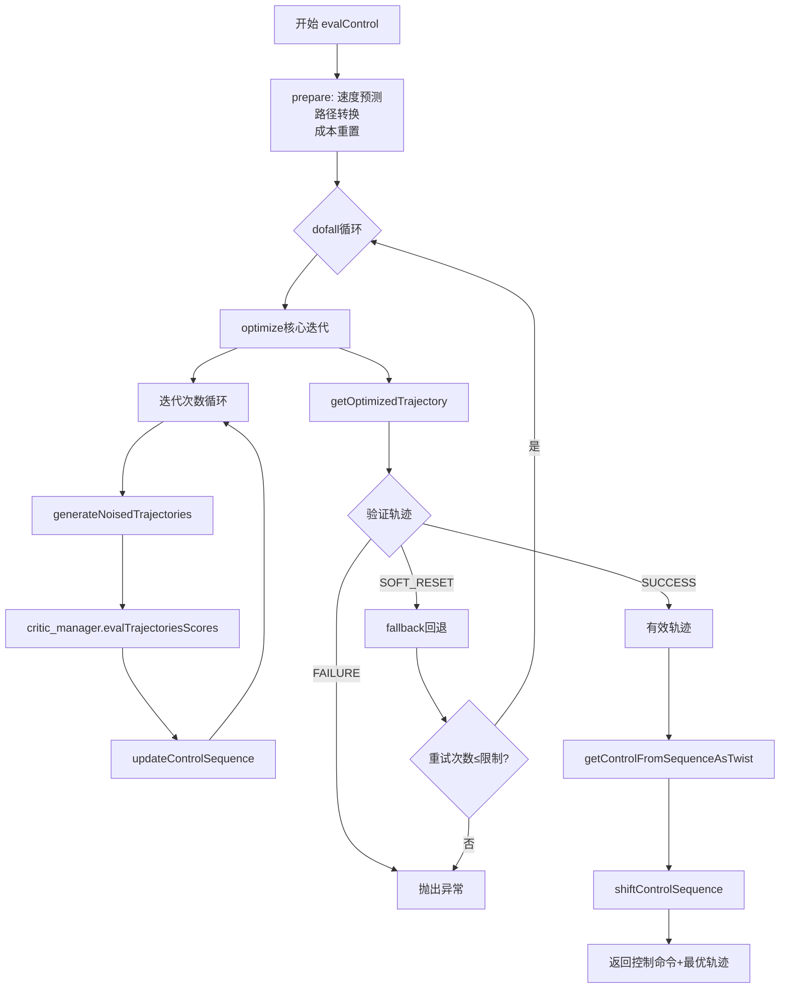
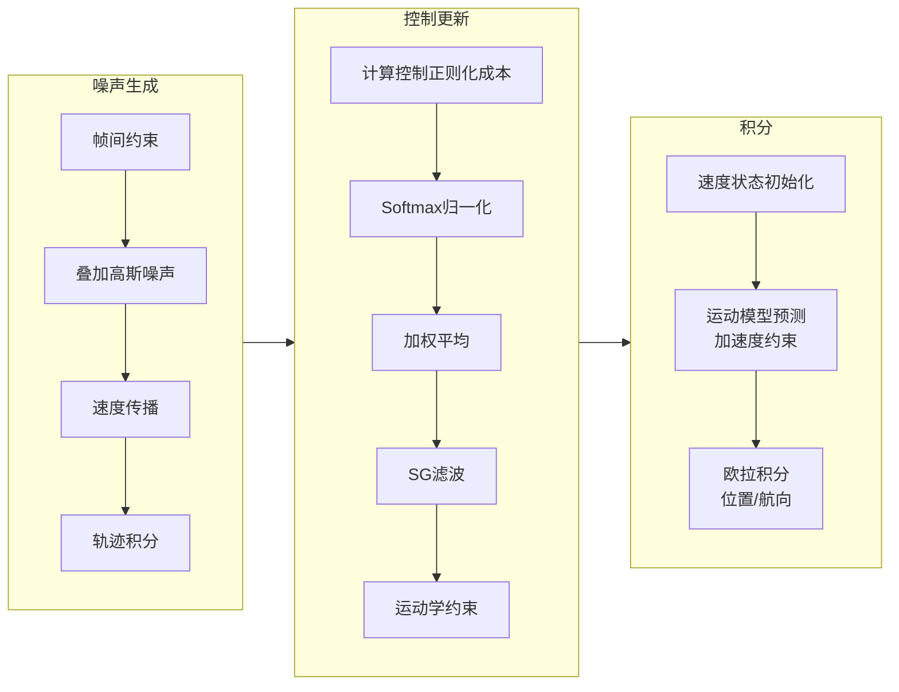

# Nav2 MPPI 控制器 — 算法原理与代码详解

> 基于 Navigation2 的 `nav2_mppi_controller` 实现分析  
> 核心文件: `optimizer.cpp`, `optimizer.hpp`, `noise_generator.cpp`, `utils.hpp` 等

---

## 目录

1. [MPPI 算法概述](#1-mppi-算法概述)
2. [核心数据结构](#2-核心数据结构)
3. [算法完整流程](#3-算法完整流程)
4. [各模块详解](#4-各模块详解)
   - [4.1 初始化与参数加载](#41-初始化与参数加载)
   - [4.2 预处理阶段 (prepare)](#42-预处理阶段-prepare)
   - [4.3 噪声轨迹生成 (generateNoisedTrajectories)](#43-噪声轨迹生成-generatenoisedtrajectories)
   - [4.4 轨迹评分 (critic_manager)](#44-轨迹评分-critic_manager)
   - [4.5 控制序列更新 (updateControlSequence)](#45-控制序列更新-updatecontrolsequence)
   - [4.6 运动学积分 (integrateStateVelocities)](#46-运动学积分-integratestatevelocities)
   - [4.7 轨迹验证与回退 (fallback)](#47-轨迹验证与回退-fallback)
   - [4.8 Savitzky-Golay 滤波](#48-savitzky-golay-滤波)
5. [参数说明](#5-参数说明)
6. [算法工作流图](#6-算法工作流图)
7. [核心公式推导](#7-核心公式推导)

---

## 1. MPPI 算法概述

**MPPI (Model Predictive Path Integral)** 是一种基于随机采样的**无导数模型预测控制**方法。与传统 MPC 需要求解带约束的数值优化问题不同，MPPI 通过以下方式获得最优控制：

1. **随机采样** — 在当前最优控制序列周围添加高斯噪声，生成大量候选控制序列
2. **前向仿真** — 使用运动模型将每个候选控制序列映射为轨迹
3. **成本评估** — 通过多个成本函数（critics）评估每条轨迹
4. **加权更新** — 利用 softmax 加权平均所有候选序列，得到新的最优控制序列
5. **迭代优化** — 重复上述步骤，直至收敛

### 核心优势

| 特性 | 说明 |
|------|------|
| **无梯度** | 不需要对成本函数求导，适合任意非光滑/离散成本 |
| **并行友好** | 采样和评估天然适合批量矩阵运算（Eigen） |
| **全局视角** | 随机探索有助于跳出局部最优 |
| **信息论基础** | 加权更新有严格的自由能最小化理论支撑 |

---

## 2. 核心数据结构

### 2.1 `OptimizerSettings` (`optimizer_settings.hpp`)

```cpp
struct OptimizerSettings {
  ControlConstraints base_constraints;  // 基础运动学约束（可恢复）
  ControlConstraints constraints;       // 当前有效约束（受速度限制影响）
  SamplingStd sampling_std;            // 各轴噪声标准差
  float model_dt;           // 模型离散时间步长 (s)
  float model_delay_vx;     // 线速度指令延迟补偿 (s)
  float model_delay_vy;     // 横向速度指令延迟补偿 (s)
  float model_delay_wz;     // 角速度指令延迟补偿 (s)
  float controller_period;  // 控制器周期 = 1/controller_frequency (s)
  float temperature;        // Softmax 温度参数
  float gamma;              // 信息论正则化系数
  unsigned int batch_size;       // 每轮迭代采样轨迹数
  unsigned int time_steps;       // 预测时域长度
  unsigned int iteration_count;  // MPPI 迭代次数
  bool shift_control_sequence;   // 是否启用控制序列位移
  size_t retry_attempt_limit;    // 最大重试次数
  bool open_loop;                // 是否使用开环模式
  unsigned int sgf_order;        // Savitzky-Golay 滤波阶数 (1 或 2)
};
```

### 2.2 `ControlConstraints` (`constraints.hpp`)

```cpp
struct ControlConstraints {
  float vx_max;   // 最大前进速度 (m/s)
  float vx_min;   // 最小前进速度（可为负，即后退）(m/s)
  float vy;       // 最大横向速度，全向机器人用 (m/s)
  float wz;       // 最大角速度 (rad/s)
  float ax_max;   // 最大正向加速度 (m/s²)
  float ax_min;   // 最大减速度（负值）(m/s²)
  float ay_min;   // 最大横向减速度（全向）(m/s²)
  float ay_max;   // 最大横向加速度（全向）(m/s²)
  float az_max;   // 最大角加速度 (rad/s²)
};
```

### 2.3 `State` (`state.hpp`)

```cpp
struct State {
  // 批量速度矩阵 [batch_size × time_steps]
  Eigen::ArrayXXf vx;   // 线速度（经加速度约束后）
  Eigen::ArrayXXf vy;   // 横向速度
  Eigen::ArrayXXf wz;   // 角速度

  // 原始带噪声控制量 [batch_size × time_steps]
  Eigen::ArrayXXf cvx;  // 带噪声的线速度控制
  Eigen::ArrayXXf cvy;  // 带噪声的横向速度控制
  Eigen::ArrayXXf cwz;  // 带噪声的角速度控制

  geometry_msgs::msg::PoseStamped pose;  // 当前机器人位姿
  geometry_msgs::msg::Twist speed;        // 当前机器人速度
  float local_path_length;                // 局部路径长度
};
```

### 2.4 `ControlSequence` (`control_sequence.hpp`)

```cpp
struct ControlSequence {
  Eigen::ArrayXf vx;  // [time_steps] 线速度控制序列
  Eigen::ArrayXf vy;  // [time_steps] 横向速度控制序列
  Eigen::ArrayXf wz;  // [time_steps] 角速度控制序列
};
```

### 2.5 `Trajectories` (`trajectories.hpp`)

```cpp
struct Trajectories {
  Eigen::ArrayXXf x;     // [batch_size × time_steps] X 坐标
  Eigen::ArrayXXf y;     // [batch_size × time_steps] Y 坐标
  Eigen::ArrayXXf yaws;  // [batch_size × time_steps] 航向角
};
```

### 2.6 `CriticData` (`critic_data.hpp`)

```cpp
struct CriticData {
  const models::State & state;         // 当前状态
  const models::Trajectories & trajectories; // 所有候选轨迹
  const models::Path & path;           // 参考路径
  const geometry_msgs::msg::Pose & goal;     // 目标位姿
  Eigen::ArrayXf & costs;              // [batch_size] 各轨迹总成本
  float & model_dt;                    // 模型时间步长
  bool fail_flag;                      // 失败标志
  nav2_core::GoalChecker * goal_checker;
  std::shared_ptr<MotionModel> motion_model;
  std::optional<std::vector<bool>> path_pts_valid;
  std::optional<size_t> furthest_reached_path_point;
  std::vector<bool> trajectories_in_collision;  // 碰撞标志
};
```

---

## 3. 算法完整流程

### 顶层入口: `evalControl()`

```
evalControl()
│
├─ 1. prepare()            ── 预处理：速度预测、路径转换、成本重置
│
├─ 2. do {                 ── 主循环（含回退重试）
│   │
│   ├─ 3. optimize()       ── MPPI 核心迭代
│   │   │
│   │   ├─ for each iteration:
│   │   │   ├─ generateNoisedTrajectories()  ── 生成噪声轨迹
│   │   │   ├─ critic_manager_.evalTrajectoriesScores()  ── 评分
│   │   │   └─ updateControlSequence()       ── 加权更新
│   │   │
│   │   └─ end for
│   │
│   ├─ 4. getOptimizedTrajectory()    ── 获取最优轨迹
│   │
│   └─ 5. validate trajectory         ── 轨迹验证
│       ├─ SUCCESS  → continue
│       ├─ SOFT_RESET → fallback → retry
│       └─ FAILURE  → throw exception
│
│   } while (fail_flag || !valid)
│
├─ 6. getControlFromSequenceAsTwist()  ── 提取控制命令
├─ 7. shiftControlSequence()           ── 序列位移（如需）
│
└─ return (control, trajectory)
```

---

## 4. 各模块详解

### 4.1 初始化与参数加载

#### `initialize()` — 启动初始化

```cpp
void Optimizer::initialize(parent, name, costmap_ros, tf_buffer, param_handler)
```

初始化流程：

```
初始化
├─ getParams()                           → 读取所有 ROS 参数
├─ critic_manager_.on_configure()        → 加载成本函数插件
├─ noise_generator_.initialize()         → 初始化噪声生成器
├─ 加载 OptimalTrajectoryValidator 插件  → 轨迹验证器
└─ reset()                               → 重置所有内部状态
```

#### `getParams()` — 参数读取

主要参数获取点：

| 参数分组 | 关键参数 |
|----------|----------|
| 模型参数 | `model_dt`, `model_delay_vx/vy/wz` |
| MPPI 参数 | `time_steps`, `batch_size`, `iteration_count`, `temperature`, `gamma` |
| 运动学约束 | `vx_max/min`, `vy_max`, `wz_max`, `ax_max/min`, `ay_max/min`, `az_max` |
| 采样噪声标准差 | `vx_std`, `vy_std`, `wz_std` |
| 其他 | `open_loop`, `sgf_order`, `retry_attempt_limit`, `motion_model` |

> **注意**: `ax_min` 和 `ay_min` 如果为正，会自动取反并打印警告。

#### `setOffset()` — 确定时序关系

```cpp
if (controller_period + eps < model_dt)     → 警告
if (|controller_period - model_dt| < eps)   → shift_control_sequence = true (启用位移)
if (controller_period > model_dt)            → 抛出异常
```

---

### 4.2 预处理阶段 (`prepare`)

```cpp
void Optimizer::prepare(robot_pose, robot_speed, plan, goal, goal_checker)
```

#### 速度预测（延迟补偿）

**闭环模式**（`open_loop = false`，默认）：

用 `last_command_vel_` 预测当前真实速度，补偿传感器-控制延迟：

$$v_{pred} = \text{clamp}(v_{cmd},\; v_{meas} + dt \cdot a_{min},\; v_{meas} + dt \cdot a_{max})$$

```
state_.speed.linear.x = clamp(last_cmd_vx, robot_vx + dt*ax_min, robot_vx + dt*ax_max)
state_.speed.angular.z = clamp(last_cmd_wz, robot_wz - dt*az_max, robot_wz + dt*az_max)
```

**开环模式**（`open_loop = true`）：

直接将 `last_command_vel_` 作为当前速度（忽略传感器测量）。

#### 其他操作

- 路径转换为张量格式
- 成本向量重置为 0
- 初始化 `CriticData` 结构

---

### 4.3 噪声轨迹生成 (`generateNoisedTrajectories`)

```cpp
void Optimizer::generateNoisedTrajectories()
```

这是 MPPI 采样阶段的核心，包含四个步骤：

#### 步骤 1: 帧间可行性约束

```cpp
applyControlSequenceInterIterationConstraints()
```

确保当前控制序列的 **t=0** 时刻能从机器人当前速度（物理上）到达。

- **控制序列位移模式**：直接将 `vx(0)` 设为当前速度（因为 vx(0) 不会被发送执行）
- **非位移模式**：用加速度约束钳制 vx(0)

$$\Delta v_{max} = T_{period} \cdot a_{max}$$
$$v_{clamped}(0) = \text{clamp}(v_{cur} + \Delta v_{min},\; v_{raw}(0),\; v_{cur} + \Delta v_{max})$$

#### 步骤 2: 叠加噪声 (`NoiseGenerator::setNoisedControls`)

```cpp
// noise_generator.cpp
state.cvx = noises_vx_.rowwise() + control_sequence.vx.transpose();
```

将预生成的高斯噪声矩阵叠加到基准控制序列上：

$$u_{noised}^{(i)} = u^* + \epsilon^{(i)},\quad \epsilon^{(i)} \sim \mathcal{N}(0, \sigma^2)$$

其中：
- $u^*$ = `control_sequence`（基准控制序列，维度 `[1 × time_steps]`）
- $\epsilon^{(i)}$ = 第 i 条轨迹的噪声（维度 `[1 × time_steps]`）
- $u_{noised}^{(i)}$ = 第 i 条带噪声控制序列（维度 `[1 × time_steps]`）
- 结果 `state.cvx` 维度：`[batch_size × time_steps]`

#### 步骤 3: 预生成下一轮噪声 (`generateNextNoises`)

支持**并行噪声生成**：用一个独立线程在后台预计算下一轮迭代的高斯噪声矩阵，减少等待时间。

#### 步骤 4: 速度传播与轨迹积分

```cpp
updateStateVelocities(state_);      // 从控制更新速度
integrateStateVelocities(...);      // 从速度积分出轨迹
```

详见 [4.6 运动学积分](#46-运动学积分-integratestatevelocities)。

---

### 4.4 轨迹评分 (`critic_manager`)

```cpp
critic_manager_.evalTrajectoriesScores(critics_data_);
```

通过插件化的成本函数（Critics）评估所有候选轨迹的质量。每个 critic 独立计算成本，汇总到 `costs_[batch_size]` 数组。

#### 可用的 Critic 插件

| Critic 名称 | 功能 |
|-------------|------|
| `obstacles_critic` | 障碍物碰撞成本（基于 costmap） |
| `path_follow_critic` | 路径跟踪偏差成本 |
| `path_angle_critic` | 路径航向对齐成本 |
| `path_align_critic` | 路径横向对齐成本 |
| `goal_critic` | 到达目标的距离成本 |
| `goal_angle_critic` | 目标航向对齐成本 |
| `cost_critic` | 综合 costmap 成本 |
| `prefer_forward_critic` | 偏好正向行驶成本 |
| `twirling_critic` | 原地旋转惩罚成本 |
| `constraint_critic` | 软约束成本 |
| `velocity_deadband_critic` | 速度死区惩罚成本 |

每个 critic 通过 `pluginlib` 动态加载，可在运行时配置启用/禁用和权重。

---

### 4.5 控制序列更新 (`updateControlSequence`)

这是 **MPPI 算法的数学核心**。代码路径在 `optimizer.cpp` 的 `updateControlSequence()` 函数中。

#### 步骤 1: 控制成本（信息论正则化）

将控制输入的成本（避免过大噪声）累加到轨迹总成本中：

$$C_{total}^{(i)} \mathrel{+}= \frac{\gamma}{\sigma^2} \sum_{t=0}^{T} (u_{noised}^{(i)}(t) - u^*(t)) \cdot u^*(t)$$

```cpp
// 以 vx 为例
auto bounded_noises_vx = state_.cvx.rowwise() - vx_T;  // 原始噪声 ε
const float gamma_vx = gamma / (sampling_std.vx^2);
costs_ += gamma_vx * (bounded_noises_vx.rowwise() * vx_T).rowwise().sum();
```

> **注意**: 这里的成本项是 $(\epsilon) \cdot u^*$ 而不是 $\epsilon^2$，这是 MPPI 的一种特殊正则化形式，源自信息论的自由能最小化推导。

#### 步骤 2: Softmax 归一化

$$w^{(i)} = \frac{\exp\left(-\frac{1}{\lambda} \tilde{C}^{(i)}\right)}{\sum_{j=1}^{N} \exp\left(-\frac{1}{\lambda} \tilde{C}^{(j)}\right)}$$

其中：
- $\tilde{C}^{(i)} = C^{(i)} - \min(C)$ — 减去最小成本（数值稳定性）
- $\lambda = temperature$ — 温度参数

```cpp
auto costs_normalized = costs_ - costs_.minCoeff();
const float inv_temp = 1.0f / temperature;
auto softmaxes = (-inv_temp * costs_normalized).exp().eval();
softmaxes /= softmaxes.sum();
```

#### 步骤 3: 加权平均更新控制序列

$$u^{new}(t) = \sum_{i=1}^{N} w^{(i)} \cdot u_{noised}^{(i)}(t)$$

```cpp
control_sequence_.vx = state_.cvx.transpose().matrix() * softmax_mat;
```

本质是：**用所有采样轨迹的加权平均作为新的控制序列**，权重由成本指数决定。

#### 步骤 4: Savitzky-Golay 滤波

```cpp
utils::savitskyGolayFilter(control_sequence_, control_history_, settings_);
```

对控制序列做时域平滑，抑制控制抖动。详见 [4.8](#48-savitzky-golay-滤波)。

#### 步骤 5: 应用运动学约束

```cpp
applyControlSequenceConstraints();
```

确保控制序列满足速度、加速度等物理约束。详见下文。

---

### 4.6 运动学积分 (`integrateStateVelocities`)

Nav2 MPPI 中有**两种积分重载**：

#### 重载 1: 单条轨迹积分（用于最终最优轨迹输出）

```cpp
integrateStateVelocities(trajectory, sequence)
```

**航向角积分**：
$$yaw(t_{i+1}) = yaw(t_i) + \omega(t_i) \cdot \Delta t$$

**位置积分（差速模型）**：
$$x(t_{i+1}) = x(t_i) + v_x(t_i) \cdot \cos(yaw(t_i)) \cdot \Delta t$$
$$y(t_{i+1}) = y(t_i) + v_x(t_i) \cdot \sin(yaw(t_i)) \cdot \Delta t$$

**位置积分（全向模型）**：
$$x(t_{i+1}) = x(t_i) + (v_x \cdot \cos(yaw) - v_y \cdot \sin(yaw)) \cdot \Delta t$$
$$y(t_{i+1}) = y(t_i) + (v_x \cdot \sin(yaw) + v_y \cdot \cos(yaw)) \cdot \Delta t$$

#### 重载 2: 批量轨迹积分（用于优化迭代）

```cpp
integrateStateVelocities(trajectories, state)
```

利用 Eigen 的矩阵运算批量处理所有采样轨迹：

```
1. 初始化所有轨迹的初始 yaw = 机器人当前 yaw
2. 逐时间步: last_yaws += state.wz.col(i) * model_dt
3. 所有轨迹的 yaw 存入 trajectories.yaws.col(i)
4. 计算 cos/sin 矩阵，执行列位移（使 t 时刻的 cos/sin 为 t-1 时刻的 yaw）
5. 利用矩阵乘法批量计算 dx, dy
6. 逐时间步积分得到 x, y
```

---

### 4.7 轨迹验证与回退 (`fallback`)

#### 轨迹验证

通过 `OptimalTrajectoryValidator` 插件验证优化后的轨迹：

```cpp
switch (trajectory_validator_->validateTrajectory(...)) {
  case ValidationResult::SOFT_RESET:
    // 软重置：重置状态并重试
    trajectory_valid = false;
    break;
  case ValidationResult::FAILURE:
    // 硬失败：抛出异常
    throw nav2_core::NoValidControl(...);
  case ValidationResult::SUCCESS:
    // 成功
    trajectory_valid = true;
    break;
}
```

#### 回退机制 (`fallback`)

```cpp
bool Optimizer::fallback(bool fail) {
  static size_t counter = 0;
  if (!fail) { counter = 0; return false; }

  reset(false /* 保留速度限制 */);

  if (++counter > retry_attempt_limit) {
    counter = 0;
    throw nav2_core::NoValidControl("Optimizer fail to compute path");
  }
  return true;  // 继续重试
}
```

重试时，`reset(false)` 会保留基于区域设置的速度限制（不重置 `constraints` 到 `base_constraints`）。

---

### 4.8 Savitzky-Golay 滤波

```cpp
// utils.hpp - savitskyGolayFilter()
```

使用 9 点窗口的 SG 滤波器平滑控制序列：

**1 阶滤波**（`sgf_order = 1`）：
$$h = \frac{1}{9}[1, 1, 1, 1, 1, 1, 1, 1, 1]$$
即均匀移动平均，平滑效果更强。

**2 阶滤波**（`sgf_order = 2`，默认）：
$$h = \frac{1}{231}[-21, 14, 39, 54, 59, 54, 39, 14, -21]$$
即标准 9 点二次 SG 系数，在平滑的同时更好地保留曲线形状。

**实现细节**：
- 用长度为 4 的 `control_history_` 环形缓冲区存储上一周期的控制值，用于边界处理
- 当序列长度 < 20 时跳过滤波

---

## 5. 参数说明

### 5.1 完整参数清单

| 参数名 | 类型 | 默认值 | 说明 |
|--------|------|--------|------|
| **模型参数** | | | |
| `model_dt` | float | 0.05 | 模型离散时间步长 (s) |
| `model_delay_vx` | float | 0.0 | 线速度指令延迟 (s) |
| `model_delay_vy` | float | 0.0 | 横向速度指令延迟 (s) |
| `model_delay_wz` | float | 0.0 | 角速度指令延迟 (s) |
| **MPPI 参数** | | | |
| `time_steps` | int | 56 | 预测时域步数 |
| `batch_size` | int | 1000 | 每轮采样轨迹数 |
| `iteration_count` | int | 1 | MPPI 迭代次数 |
| `temperature` | float | 0.3 | Softmax 温度。值越小，最优轨迹权重越大 |
| `gamma` | float | 0.015 | 控制正则化系数。值越大，越抑制大幅噪声 |
| **速度约束** | | | |
| `vx_max` | float | 0.5 | 最大前进速度 (m/s) |
| `vx_min` | float | -0.35 | 最小前进速度（负值=后退）(m/s) |
| `vy_max` | float | 0.5 | 最大横向速度 (m/s) |
| `wz_max` | float | 1.9 | 最大角速度 (rad/s) |
| **加速度约束** | | | |
| `ax_max` | float | 3.0 | 最大正向加速度 (m/s²) |
| `ax_min` | float | -3.0 | 最大减速度 (m/s²) |
| `ay_max` | float | 3.0 | 最大横向加速度 (m/s²) |
| `ay_min` | float | -3.0 | 最大横向减速度 (m/s²) |
| `az_max` | float | 3.5 | 最大角加速度 (rad/s²) |
| **采样标准差** | | | |
| `vx_std` | float | 0.2 | 线速度采样标准差 |
| `vy_std` | float | 0.2 | 横向速度采样标准差 |
| `wz_std` | float | 0.4 | 角速度采样标准差 |
| **控制参数** | | | |
| `open_loop` | bool | false | 开环模式（直接用上次命令作为当前速度） |
| `sgf_order` | int | 2 | SG 滤波阶数（1 或 2） |
| `retry_attempt_limit` | int | 1 | 最大重试次数 |
| `controller_frequency` | double | 0.0 | 控制器频率 (Hz)。与 model_dt 共同决定是否启用序列位移 |

### 5.2 参数调优建议

| 场景 | 参数调整 |
|------|----------|
| **轨迹更平滑** | 增大 `temperature`、增大 `sgf_order` |
| **反应更灵敏** | 减小 `temperature`、减小 `gamma`、增大 `iteration_count` |
| **探索更多** | 增大 `vx_std`/`wz_std`、增大 `temperature` |
| **避免抖动** | 增大 `gamma`、增大 `sgf_order`、减小 `sampling_std` |
| **计算性能** | 减小 `batch_size`、减小 `time_steps`、减小 `iteration_count` |
| **复杂环境避障** | 增大 `batch_size`、增大 `iteration_count` |

### 5.3 `controller_frequency` 与 `model_dt` 的关系

| 关系 | 结果 |
|------|------|
| `1/freq < model_dt` | 警告：控制周期小于模型步长 |
| `1/freq ≈ model_dt` | `shift_control_sequence = true`，启用控制序列位移 |
| `1/freq > model_dt` | 抛出异常（不允许） |

**控制序列位移**的工作原理：
```
无位移: 发送 vx(0) 作为命令 → 但执行时已是新的控制周期
有位移: vx(0) 固定为当前速度，发送 vx(1) 作为命令
        → 控制命令与执行时间精确对齐
```

---

## 6. 算法工作流图



### 详细子流程



---

## 7. 核心公式推导

### 7.1 MPPI 优化目标

MPPI 最小化以下自由能目标函数：

$$u^* = \arg\min_{u} \left[ \underbrace{\mathbb{E}_{q}[S(\tau)]}_{\text{期望成本}} + \lambda \cdot \underbrace{D_{KL}(q \parallel p)}_{\text{KL散度正则化}} \right]$$

其中：
- $q$ 是实际采样分布
- $p$ 是基准（先验）分布
- $S(\tau)$ 是轨迹 $\tau$ 的总成本
- $\lambda = temperature$ 控制探索-利用平衡

### 7.2 最优权重解

通过变分法，可以证明最优权重为 softmax 分布：

$$w^{(i)} = \frac{\exp\left(-\frac{1}{\lambda} S(\tau^{(i)})\right)}{\sum_{j=1}^{N} \exp\left(-\frac{1}{\lambda} S(\tau^{(j)})\right)}$$

### 7.3 控制正则化项

代码中实现的额外成本项：

$$C_{reg}(\tau) = \frac{\gamma}{\sigma^2} \sum_{t} (u_{noised}(t) - u^*(t)) \cdot u^*(t)$$

这个形式来自于将高斯分布假设下的 KL 散度展开后的交叉项。

### 7.4 双阶段加速度约束

第一阶段（t=0，使用 `controller_period`）：
$$\Delta v_{max}^{t=0} = T_{period} \cdot a_{max}$$

第二阶段（t≥1，使用 `model_dt`）：
$$\Delta v_{max}^{t≥1} = \Delta t_{model} \cdot a_{max}$$

这种设计确保了：
- **帧间可行性**：当前速度 → 发送命令在物理上可达
- **帧内可行性**：预测时域内相邻步长也满足物理限制

### 7.5 延迟补偿

$$v_{predicted} = v_{measured} + \text{clamp}(v_{command} - v_{measured},\; dt \cdot a_{min},\; dt \cdot a_{max})$$

即向上次发送的命令方向预测当前速度，但用加速度限制钳制，避免预测值超出物理可实现范围。

---

## 参考

- [原始 MPPI 论文](https://ieeexplore.ieee.org/document/7487277): Williams et al., "Information-Theoretic Model Predictive Control: Theory and Applications to Autonomous Driving"
- [Nav2 MPPI Controller 文档](https://navigation.ros.org/configuration/packages/configuring-mppi.html)
- 源代码: `navigation2/nav2_mppi_controller/`
